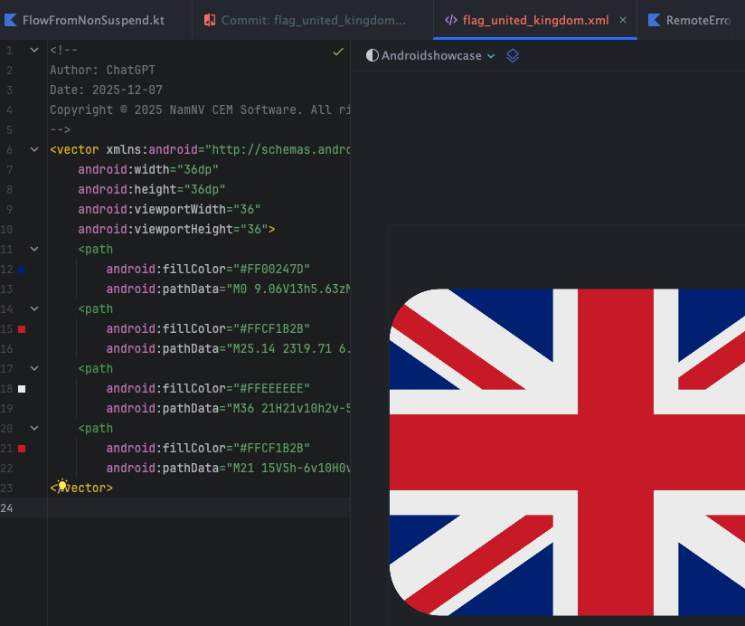
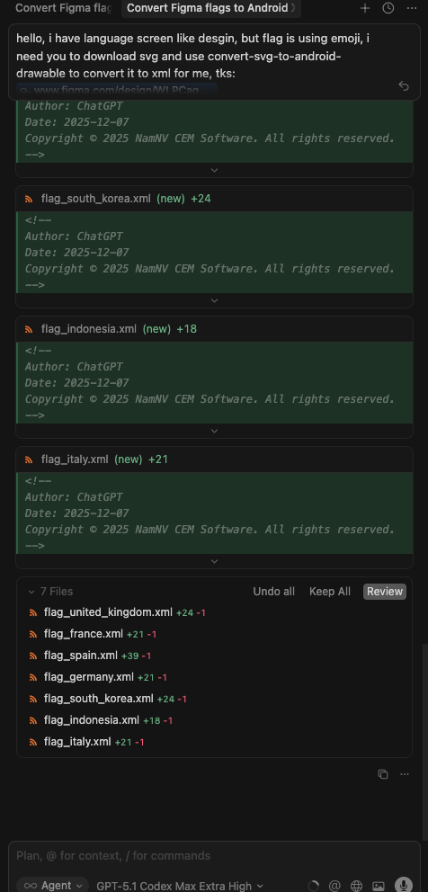
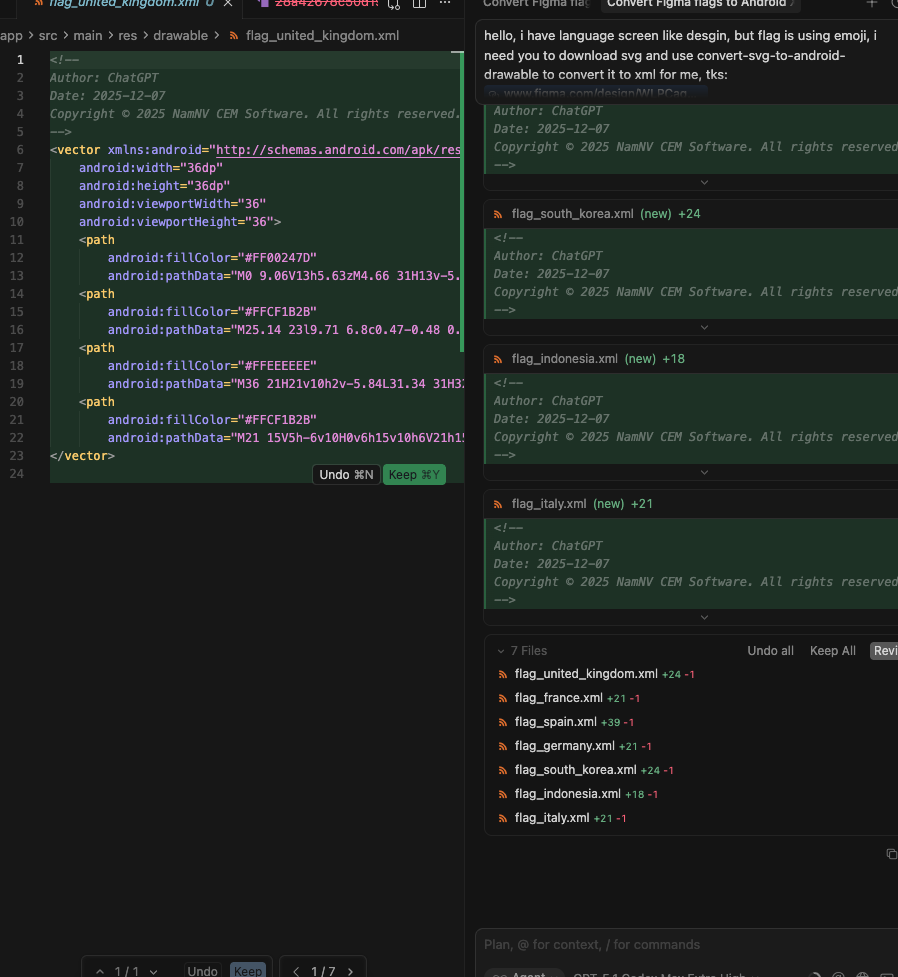

# Android SVG → Drawable MCP Server

Small MCP server that turns SVG markup/files into Android VectorDrawable XML. Built to be dropped into MCP-friendly clients and to grow with more Android utility tools over time.

## Why this exists
- Speed up “SVG to VectorDrawable” without opening Android Studio.
- Provide consistent, scriptable output for MCP agents.
- Leave room to add more Android utilities (e.g., bitmap → vector helpers, asset validators) under the same MCP server in the future.

## Figma MCP pairing
- Works well alongside the Figma MCP server: grab SVGs from designs and pass them directly to `convert-svg-to-android-drawable`.
- Useful for replacing emoji flags or exported PNGs with scalable VectorDrawable assets in language pickers and similar screens.
- Example flow: request SVG from Figma → feed inline SVG to the tool → get XML ready for Android resources.

### Previews





## Current tool
`convert-svg-to-android-drawable`
- Inputs: `svg` (inline) **or** `svgPath` (file path). Optional: `outputPath`, `floatPrecision` (default 2), `fillBlack` (default false), `xmlTag` (default false), `tint`, `cache` (default true).
- Output: VectorDrawable XML text; also writes to disk when `outputPath` is provided.
- Performance: LRU cache (32 entries) keyed by SVG + options plus fast reuse in-session.
- Converter: vendored fork in `vendor/svg2vectordrawable` with fixes for `rgb()/rgba()`, `hsl()/hsla()`, and named colors. Upstream license: `vendor/svg2vectordrawable/LICENSE` (MIT).

## Roadmap (planned)
- Additional MCP tools for Android assets (e.g., batch conversions, validations, optimizers).
- Optional resource prompts for common Android drawables/templates.

## Quick start
- `npm install`
- `npm start` (keeps running on stdio; point your MCP client at `node src/index.js`)

## Run via npx
- From repo root: `npx .` (uses `svg-to-drawable-mcp` bin; runs on stdio)

## Run with Docker
- Build: `docker build -t svg-to-drawable-mcp .`
- Run: `docker run --rm -it svg-to-drawable-mcp`
- The container prints to stdio; point your MCP client at `docker run --rm -i svg-to-drawable-mcp`.

## Use in Cursor (MCP config)
Add to your Cursor settings JSON:
```json
{
  "mcpServers": {
    "figma-desktop": {
      "url": "http://127.0.0.1:3845/mcp"
    },
    "svg-to-android-drawable": {
      "command": "npx",
      "args": [
        "-y",
        "/Users/admin/code/android_util_mcp_server"
      ]
    }
  }
}
```
Adjust the local path if your repo lives elsewhere.

## Examples
- Input SVG: `sample_svg.svg`
- Output VectorDrawable: `examples/sample_svg.xml`

## Notes
- Transport: stdio via `@modelcontextprotocol/sdk`.
- Base deps kept minimal; everything needed to convert SVGs is vendored/included.

## Contact
- nam.nv205106@gmail.com
